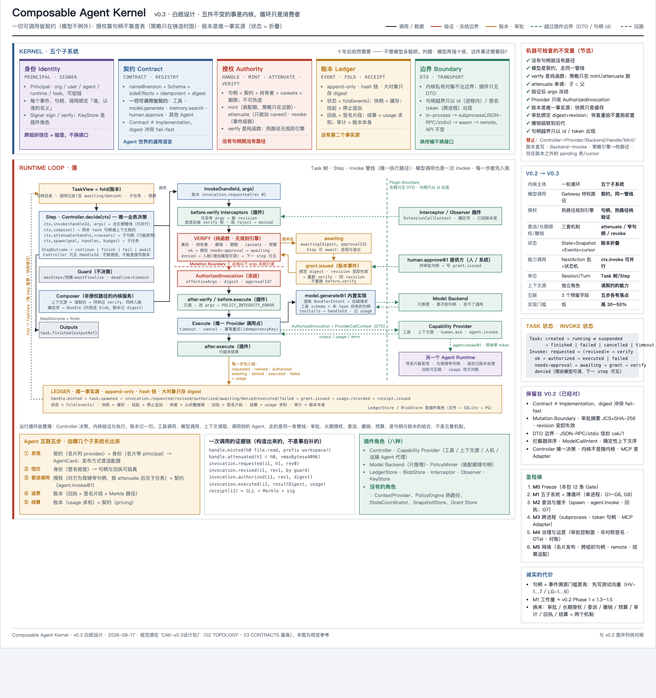

# cak · Composable Agent Kernel

**一个内核，一套插件生态，Agent 之间靠契约互联。**
装内核 → `cak` → 起一个纯内核 → 装插件 → 一份配置拼出你要的 agent。所有事都记在不可篡改的账本里，agent 想干什么都得持"句柄"。

> *cak is a small, auditable kernel for AI agents: everything callable is a contract, all authority is a capability handle, and the ledger is the single source of truth. Agents are assembled from plugins (capabilities, controllers, model backends, frontends) on top of one kernel, and talk to each other through contracts. Status: 0.3.0, kernel interface frozen (1.0.0-rc.2); docs are in Chinese for now.*



---

## 目录
1. [它是什么、不是什么](#1-它是什么不是什么)
2. [30 秒上手](#2-30-秒上手)
3. [核心概念（五个词）](#3-核心概念五个词)
4. [架构](#4-架构)
5. [装内核 → 起内核 → 装插件 → 拼 agent](#5-装内核--起内核--装插件--拼-agent)
6. [插件：类型、信任、怎么写、怎么发布](#6-插件类型信任怎么写怎么发布)
7. [前端（TUI / 网页 / 你自己的）](#7-前端tui--网页--你自己的)
8. [多 agent 互联](#8-多-agent-互联)
9. [安全模型](#9-安全模型)
10. [协议与 SDK](#10-协议与-sdk)
11. [仓库地图与文档](#11-仓库地图与文档)
12. [现状、边界与路线](#12-现状边界与路线)
13. [贡献与许可](#13-贡献与许可)

---

## 1. 它是什么、不是什么

**是**：一个 agent 内核 + 插件生态。内核只做五件事（身份、契约、授权、账本、边界），运行循环是它的消费者；agent 的"脑子"（控制器）、"手"（能力）、"嘴"（模型后端）、"脸"（前端）全是插件。任何东西——文件系统、数据库、网页、浏览器、GitHub、别的 agent、人——都被包成**契约**接进来，走同一条管线：验证 → 入账 → 执行。

**不是**：不是又一个 agent 框架里的"工具箱"，也不是聊天应用。它不替你选模型（模型也是插件），不预设 agent 该长什么样（agent 是配置拼出来的）。

三句设计主张（`docs/design/01`）：
- **一切可调用皆契约**——连 `model.generate`、`human.approve`、`agent.invoke`、`plugin.install` 都是契约，没有特权后门。
- **授权靠句柄不靠表**——ocap：铸造时定策略、热路径纯验证、收窄只能加限制、委派 = 收窄、长期授权 = 窄句柄、撤销 = 事件级联。
- **账本是唯一事实源**——append-only 哈希链；状态 = 折叠，快照 = 缓存，回执 = 签名片段，结算 = usage 求和。

## 2. 30 秒上手

需要 Node.js ≥ 22、git、一个模型 API key（目前真跑过 DeepSeek；Anthropic 后端有、未联网验证）。

```bash
git clone https://github.com/theyuyan/cak.git && cd cak
npm install && npm test        # 期望全绿
npm link                       # 得到 `cak` 命令（发布 npm 后：npm i -g cak）

cd 你的某个目录
cak                            # 第一次会问你要 key（隐藏输入，直接写进 ~/.cak/secrets/，不进任何日志）
```
`cak` 一个词 = 在当前目录起内核进程（已在跑就复用）+ 挂一个引导用的最小 agent（bare）+ 打开界面。然后对它说：
```
› 我想让你能读 PDF          ← 它去注册表找、问你一次、装上、立刻能用
› 帮我看看这个目录里有什么   ← 读类操作不问你
› 把 README 的安装步骤改成中文 ← 写文件会弹审批：y 只批这次 / N 拒 / a 本轮全批 / s 本会话同类不再问
```
`cak stop` 停；`cak doctor` 体检；`cak --front web` 用浏览器界面。手册：`docs/manual/00_快速开始.md`。

## 3. 核心概念（五个词）

| 词 | 一句话 | 你在哪看到它 |
|---|---|---|
| **契约 Contract** | `name@version` + 输入/输出 JSON Schema + 副作用 + 幂等 + 权限，`schemaDigest` 锁定，不可变 | `contracts/builtin/*.json`（34 个）；插件按契约实现 |
| **句柄 Handle** | 授权凭证 = 契约 + 持有者 + caveats（限制）+ 期限。收窄只能加限制；`requires-approval` 就是"要问你" | 审批提示、`/handles`、`s` 铸的常设句柄 |
| **账本 Ledger** | 每一步（请求/授权/审批/执行/结果摘要/用量）append-only 入账，哈希链，SQLite | `~/.cak/sessions/*.sqlite`；`/report` |
| **Agent 配置 Profile** | 一份 YAML：控制器是谁、用哪个模型后端、持有哪些能力、上下文源 | `~/.cak/agents/*.yaml`（内置 bare / coding / review） |
| **插件 Plugin** | 按角色接入：capability / controller / model-backend / interceptor / observer / policy-minter / frontend | `cak add`、注册表、`~/.cak/plugins/` |

## 4. 架构

```
┌────────────────────────────── 内核进程（cak up / cak）──────────────────────────────┐
│  内核服务：插件管理 · agent 配置管理 · 控制面(JSON-RPC + SSE) · 注册表拉取            │
│  ┌── agent A（profile）──┐  ┌── agent B ──┐   … 0..N 个，各自账本/会话，可 add / remove │
│  │ Controller（决策）    │  │             │                                             │
│  │ Kernel 五子系统 ──────┼──┼─────────────┼── Identity · Contract · Authority · Ledger · Boundary
│  │ 句柄目录 → 能力插件（子进程 / MCP 桥 / 进程内）· 模型后端 · 上下文源                    │
│  └───────────────────────┘  └─────────────┘                                             │
└─────────────┬───────────────────────────────────────────────────────────────────────────┘
              │ 本机控制面（127.0.0.1 + 每进程随机 token）
   ┌──────────┴─────────┐
   TUI    tty    web    你写的前端插件（只看事件、审批、发输入；拿不到能力）
```
- **运行循环**（`docs/design/06`）：Task 树 · Step · `ctx.invoke` 管线（before.verify 拦截器 → 路由 → 入参 schema 校验 → 句柄 verify → 审批/拒绝/授权 → 冻结 args → 执行 → 出参校验 → 入账）。模型调用也是一次 invoke。
- **边界**（`docs/design/09`）：进程内 · 子进程 stdio JSON-RPC（`cak/1`）· HTTP JSON-RPC；插件只见 DTO，拿不到内核内部对象。
- **内核接口面已冻结**（`docs/design/16`）：`sdk/types.ts` 54 个符号、Kernel 20 个方法、33 种事件、25 个错误码、10 种 caveat、传输协议——`tools/api-surface.mjs` 指纹守卫，改了测试就红。之后连续多轮大改（插件、前端、profile、多 agent）内核零改动。

## 5. 装内核 → 起内核 → 装插件 → 拼 agent

```
1  装内核    npm i -g cak（发布后）/ 现在：clone → npm install → npm link
2  起内核    cak up [--no-agent]        纯内核也成立：插件/配置管理不依赖任何模型
             cak                        默认顺手挂一个 bare（引导 agent，可摘可换）
3  装插件    对它说「我想让你能…」        或 cak add <id> --registry ~/.cak/registry
             （trust-but-verify：拉代码 → 构建 → 在你本机复跑一致性测试 → 全过才装 → 所有 agent 热加载）
4  拼 agent  cak agent init my --from bare|coding|review
             编辑 ~/.cak/agents/my.yaml（换控制器 / 换后端 / 加减能力与 caveat）
             cak up --agent my        或   cak agent add my（挂到在跑的内核里）
```
一份 profile 就是 AgentSpec（schema 在 `docs/design/07`）：
```yaml
spec:
  controller: { provider: cak-code, config: { persona: general } }   # 内置 4 个，或已装的 controller 插件 id
  model: { backend: deepseek, model: deepseek-chat }                 # 内置 deepseek/anthropic，或 model-backend 插件 id
  grants:                                                            # 持有的能力；已装能力插件的契约会自动追加
    - { contract: file.read, caveats: [{ kind: args.max, path: maxBytes, max: 262144 }] }
    - { contract: shell.exec, caveats: [{ kind: requires-approval, approver: any-with-approve-handle, ttlMs: 1800000 }] }
```
详见 `docs/manual/07_搭建自己的agent.md`。

## 6. 插件：类型、信任、怎么写、怎么发布

| 角色 | 形态 | 信任级 | 装进来去哪 |
|---|---|---|---|
| `capability`（能力） | 子进程（stdio JSON-RPC）· MCP 桥 · 进程内 | T1（本机复跑 conformance）| 契约进 agent 的句柄目录；read/none 免审批，其余审批 |
| `controller`（决策） | 子进程（推荐，任何语言）· 进程内 | 子进程 T1 / 进程内 T2 | profile 的 `controller.provider` 可选项 |
| `model-backend` / `interceptor` / `observer` / `policy-minter` | 进程内 | T2 | 后端可选项 / 自动挂上 |
| `frontend`（界面） | 独立进程，只连控制面 | 只拿控制面权限 | `cak front --list` |

**写一个（TypeScript）**：
```bash
npx create-cak-plugin my-tool --contract file.read --digest sha256:…   # digest 从注册表 contracts/ 抄
cd my-tool && npm install && npm run build && npm run conformance
```
只需实现 `listImplementations()` 与 `execute(inv, ctx)`；同一份代码进程内 `new Provider()`、子进程 `servePlugin(provider, {...})`。**Python** 零依赖：`from cak_sdk import serve_plugin, ok` → 同一条协议、同一套 conformance。其他语言按 `cak/1` 协议（JSON-RPC 2.0 over NDJSON，几个方法）自己写即可。

**规矩**：声明 `idempotent: true` 的契约输出里不能有每次都变的字段（conformance 会比对两次结果）；输出必须合 outputSchema；conformance 过 ≠ 逻辑对——给插件写自己的测试。

**发布**：代码放 git 仓库 → 在 [`cak-registry`](https://github.com/theyuyan/cak-registry) 的 `index.json` 加条目（`install: {type: git, url, ref, subdir}` + `entrypoint` + `contracts`/`roles` + 人话 `description`/`keywords`/`setup`）→ PR。用户 `cak add` 时会在本机再跑一次 conformance。现有社区插件在 [`cak-plugins`](https://github.com/theyuyan/cak-plugins)：http-fetch · sql-query · memory-sqlite · doc-read · web-search · browser · github · pkg-info · notify · front-plain（+ Python 示例 py-summarize）。手册：`docs/manual/03_插件手册.md`。

**MCP**：工作区放 `.mcp.json`（与 Claude Code / Cursor 同格式）即接入，工具映射为 `x.mcp.<server>.<tool>` 契约，默认审批。

## 7. 前端（TUI / 网页 / 你自己的）

内核进程对外只开一个**控制面**（`session.* / plugins.* / agents.*` JSON-RPC + SSE 事件流，127.0.0.1，每进程随机 token 写在 `~/.cak/daemon/<name>.json` 0600）。前端只做"看事件、审批、发输入"，拿不到能力。
- `cak front`（默认 TUI：单栏三段、流式吐字、单键审批 y/N/a/s、`/handles` 面板、`/theme` 四套主题）· `cak front tty`（最薄）· `cak front web`（浏览器，daemon 直接提供）· `cak front --list / --default`
- 写你自己的：`apps/cak-front/client.ts`（`call` / `events`）+ `apps/cak-code/format.ts`；注册表条目 `roles: ["frontend"]`。社区仓库里 `front-plain` 是 60 行零依赖示例。
手册：`docs/manual/06_前端与常驻.md`。

## 8. 多 agent 互联

一个 agent 既能 `serve` 也能 `invoke`：名片（含 Ed25519 公钥）→ 信任对方公钥 → `agent.invoke`（句柄 caveat 锁死能调谁、调什么）→ 对方按自己账本处理 → 返回**签名回执**（Merkle 根覆盖对方全部事件）→ 调用方验签。示例：`cak-review`——独立进程的审查 agent，cak-code 提交前必须送审、回执可验（`docs/manual/01`）。发现与结算：注册表 R1（Git 索引）+ `pricing`/usage 对账单；托管注册表、跨机 TLS、真实支付在路线图里。

## 9. 安全模型

保护什么：越权（句柄 caveat 在执行前拒）· 模型胡编参数（入参 schema 校验）· 危险操作未经你同意（默认审批，绑定这一次调用的摘要）· "始终允许"变无限授权（不是关审批，是新铸窄句柄，有到期可撤）· 坏插件（子进程 + 装前本机 conformance + digest 不符拒）· 冒充与篡改（Ed25519 身份 + 签名回执）· 事后抵赖（哈希链账本）· 口令进上下文（key 在文件，插件按别名取）。
不保护什么：不防你自己按 y；拿到的句柄它会想尽办法用；没有 TLS/鉴权（跨机自己套隧道）；不审计插件代码；账本明文；未经第三方安全审计。详见 `docs/manual/05_安全模型.md`。

## 10. 协议与 SDK

- 线协议 `cak/1`：JSON-RPC 2.0 over NDJSON（stdio）；方法：`plugin.hello/health/shutdown · capability.execute · controller.decide + 反向 ctx.* · cancel · event.publish …`；错误码 -32700/-32600/-32601/-32602/-32603。
- `@cak/sdk`（TS，`sdk/`）与 `cak-sdk`（Python，`sdk-python/`，零依赖）实现同一协议；发布前用 `cd sdk && npm pack` / `pip install -e sdk-python`。
- 契约、AgentSpec、PluginManifest 的 JSON Schema 在 `docs/design/07 / 13` 与 `contracts/builtin/`。

## 11. 仓库地图与文档

| 仓库 | 内容 |
|---|---|
| **cak**（本仓库） | 内核 `kernel/` · SDK `sdk/` `sdk-python/` · 内置插件 `plugins/` · 应用 `apps/`（cak-code 宿主/daemon、cak-review、cak-front）· 契约 `contracts/builtin/` · CLI `bin/` · 手册与设计 `docs/` |
| [cak-registry](https://github.com/theyuyan/cak-registry) | 注册表 R1：`index.json` + 契约 + RFC 模板 + 校验 CI |
| [cak-plugins](https://github.com/theyuyan/cak-plugins) | 社区插件 monorepo（vendored `@cak/sdk` tarball，发 npm 后改依赖） |
| [create-cak-plugin](https://github.com/theyuyan/create-cak-plugin) | 插件脚手架 |

文档：**手册** `docs/manual/00–07`（快速开始 / 安装部署 / 使用 / 插件 / 排障 / 安全 / 前端 / 搭 agent）· **设计包** `docs/design/00–18`（架构、契约、句柄、账本、运行循环、AgentSpec、测试验收、**决策记录 N-1…N-49**、路线、生态、接口面冻结、成熟度路线、TUI 设计稿）· 各里程碑报告 `docs/M1–M5_REPORT.md`。

## 12. 现状、边界与路线

- 版本 0.3.0；内核接口面冻结为 `kernel-1.0.0-rc.2`；154 个测试；本机 dogfood 多轮（用它改它自己的代码库、修埋入 bug、多 agent 送审、真 MCP、真浏览器）。
- **诚实边界**：只在 macOS（Intel）+ DeepSeek 真跑过；Windows 未测（代码按 Windows 惯例处理过 `os.homedir()` 与 `.cmd` 垫片）；Anthropic 后端未联网；web-search 未用真 key；未发 npm/PyPI；未经外部安全审计；只有作者一个人用过。
- 成熟度路线（`docs/design/17`）：L1 本机可用（现在）→ L2 交给开发者（三平台 CI、发布、第二模型、陌生人 30 分钟跑通）→ L3 交给团队（外部插件、跨机、托管注册表、外部审计）→ L4 普通用户（桌面壳、多后端、结算）。

## 13. 贡献与许可

Apache-2.0（`LICENSE`，`NOTICE`）。贡献走 DCO（提交带 `Signed-off-by:`，`CONTRIBUTING.md`）；安全问题见 `SECURITY.md`；治理 `GOVERNANCE.md`。改内核 Stable 接口面前先读 `docs/design/16`：插件适配不了默认改插件或出新契约版本，不改内核。
